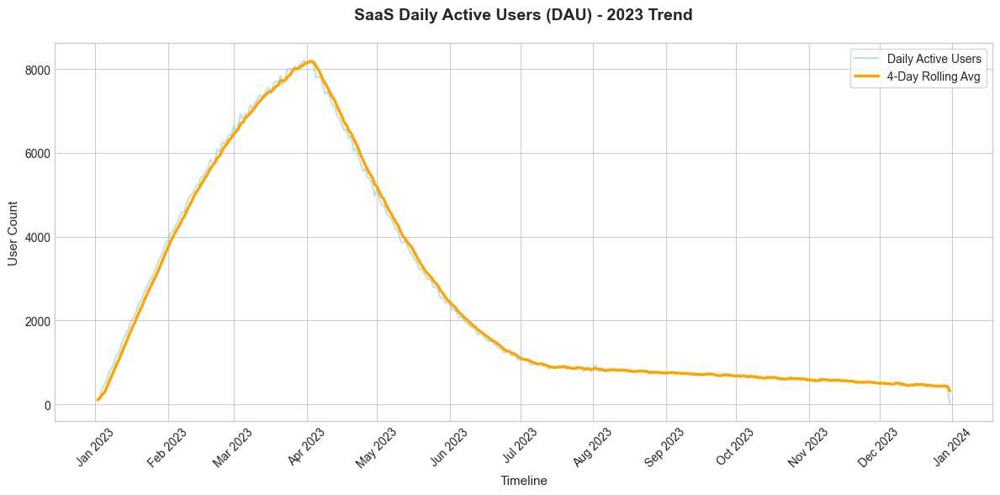
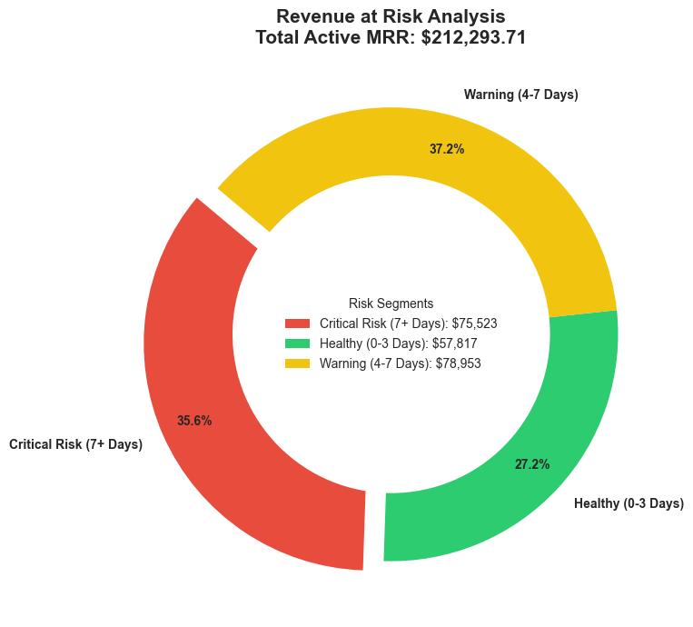
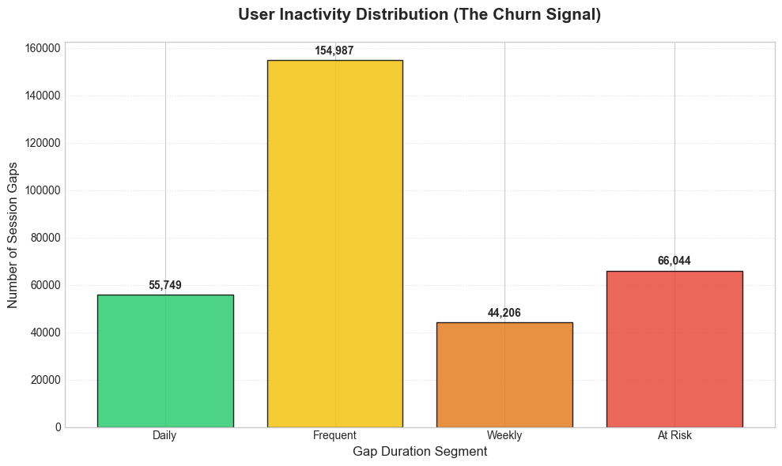
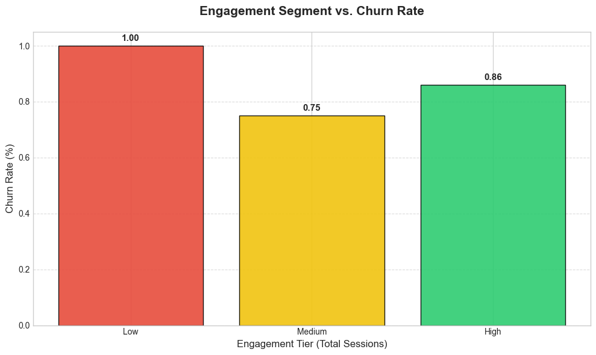
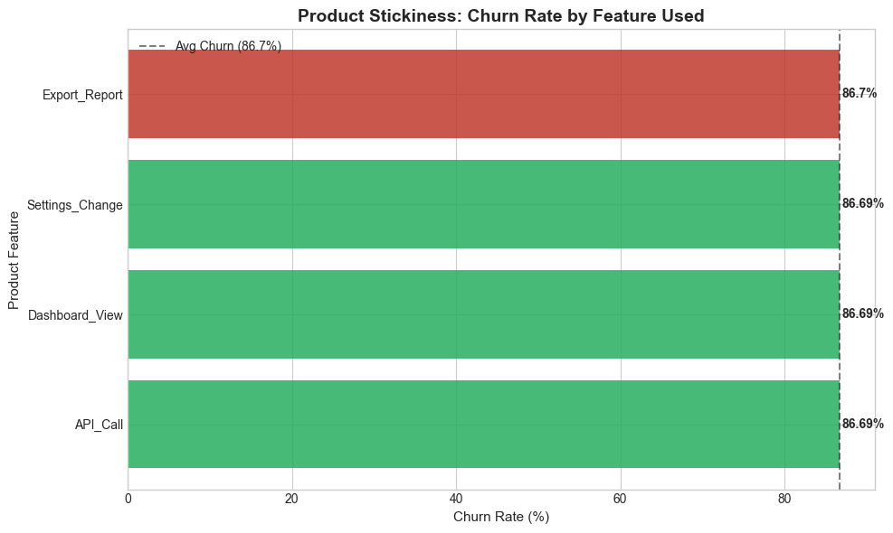

```markdown id="final_readme_v1"
# SaaS Churn & User Behavior Analytics

**Focus:** User Engagement | Churn Analysis | Revenue Risk  
**Tech Stack:** SQL (BigQuery), Python (Pandas, Matplotlib)

---

## 📌 Business Overview

This project analyzes user activity data from a SaaS platform to understand:

- How user engagement evolves over time  
- What behavioral patterns are associated with churn  
- How inactivity translates into potential revenue risk  

The dataset (~1M+ rows) is synthetically generated to simulate real-world SaaS usage patterns.

**Objective:**  
Identify **early churn signals** and quantify **business impact (MRR at risk)**.

---

## ⚙️ Technical Pipeline

1. **Ingestion:** Raw SaaS activity and subscription logs stored as CSVs  
2. **Processing (BigQuery):** 16 SQL scripts for aggregation & window functions  
3. **Extraction:** Business metrics exported to `data/csv_files/`  
4. **Intelligence:** Python generates visual insights in `/visuals`  

---

## 📊 Key Insights

### 1. Daily Active Users (DAU Trend)



> ⚠️ **Engagement drops after initial adoption — indicating early-stage retention is the primary failure point.**

### 5. Revenue at Risk



> 💰 **35% of revenue sits in inactive accounts — pointing to missed opportunities in retention.**

---

### 1. Daily Active Users (DAU Trend)


- DAU shows initial growth followed by steady decline  
- Rolling average smooths short-term fluctuations  

**Interpretation:**  
User engagement drops after initial adoption phase.

---

### 2. Session Gap Analysis (Churn Signal)



- Users segmented by inactivity: Daily → At Risk  
- Significant volume observed in higher gap buckets  

**Interpretation:**  
Increasing session gaps act as an early churn indicator.

---

### 3. Engagement vs Churn



- Users segmented into Low, Medium, High engagement  
- Lower engagement segments show higher churn  

**Interpretation:**  
Engagement intensity strongly correlates with retention.

---

### 4. Feature Stickiness



- Churn rates are similar across features  

**Interpretation:**  
Feature usage alone does not explain retention differences.  
Further analysis needed on:
- Usage frequency  
- Feature combinations  
- User journey  

---

### 5. Revenue at Risk


- Users grouped by inactivity duration  
- MRR aggregated across risk segments  

**Key Observation:**
- Total Active MRR: **~$212K**
- Critical Risk: **~$75K (~35%)**
- Warning: **~$78K (~37%)**

**Interpretation:**  
A large portion of revenue is tied to inactive users, indicating potential future loss.

---

## 💡 Key Takeaways

- Engagement declines after initial adoption  
- Session inactivity is a strong churn signal  
- Low engagement users are high-risk  
- Revenue risk can be quantified using behavioral signals  

---

## 💡 Recommendations

### 1. Trigger Re-engagement at 4–7 Days
- Target users before entering critical risk  

**Actions:**
- Email reminders  
- In-app nudges  

---

### 2. Prioritize High-Value At-Risk Users
- ~35% MRR in high-risk segment  

**Actions:**
- Customer success outreach  
- Retention incentives  

---

### 3. Improve Early Engagement
- Low engagement users churn more  

**Actions:**
- Better onboarding  
- Highlight core features early  

---

### 4. Deepen Feature Analysis
- Current feature data lacks differentiation  

**Next Steps:**
- Analyze feature usage depth  
- Combine with engagement segments  

---

### 5. Build Monitoring System
- Track inactivity + engagement trends  

**Outcome:**  
Early detection of churn risk  

---

## 📁 Repository Structure

```

├── sql_queries/ # 16 SQL scripts covering exploration → churn → revenue analysis
├── scripts/ # Python scripts for data generation and visualization
├── data/
│ ├── raw/ # Sample input datasets (activity, subscription, users)
│ └── csv_files/ # Processed outputs used for visualization
├── visuals/ # Final charts used in README (DAU, churn, revenue risk)
├── exploration/ # Schema checks and intermediate query/debug outputs
├── notebooks/ # Jupyter notebook for visual exploration (optional analysis)
├── requirements.txt # Python dependencies required to run the project
└── README.md # Project documentation and business insights

```

---

## 🚀 How to Reproduce

1. Run `generate_churn_data.py`  
2. Execute SQL queries in BigQuery  
3. Run `generate_visuals.py`  

---

## 🧠 Skills Demonstrated

- SQL (CTEs, Window Functions)  
- Behavioral Analytics  
- Churn Analysis  
- Data Visualization  
- Business Insight Generation  

---

## 📌 Notes

- Data is synthetically generated  
- Sample datasets provided for reference  
```

---